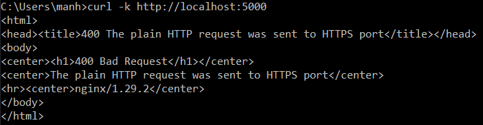

## Introduction

This project provides guidance and configuration to set up SSL (HTTPS) on an Nginx server using Docker. You will see how to switch from insecure HTTP to secure HTTPS and how requests are handled.

## Project Structure

```text
ssl-on-nginx/
├── app/                # Web application
├── nginx/              # Nginx configuration handling SSL
├── readme/             # Illustrative images
├── .gitignore
├── Makefile            # Utility commands
└── docker-compose.yml  # Docker Compose to run Nginx and the app
```

## Quick Start

**1, Clone the project:**
```bash
git clone <repo-url>
cd ssl-on-nginx
```

**2, Build and run Docker Containers:**
```bash
docker-compose up -d --build
```

**3, Test access:**
```bash
HTTP: http://localhost:5000
HTTPS: https://localhost:5000
```

## Illustrations

**1. Request Flow**


**2. Failed HTTP request**


**3. Successful HTTPS request**


